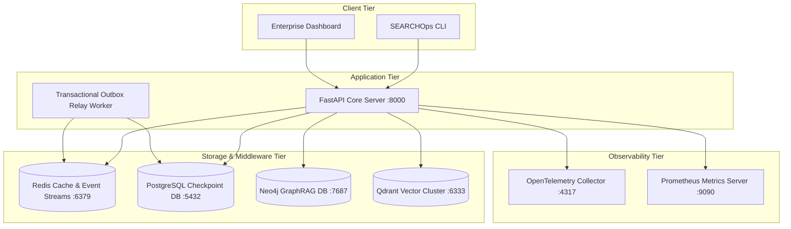
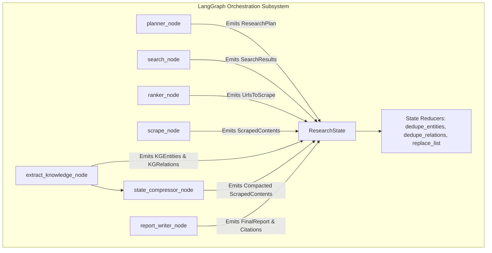

# SEARCHOps Architecture Reference Manual

```
================================================================================
                               SEARCHOps PLATFORM
                     ARCHITECTURE REFERENCE MANUAL (v0.1.0)
================================================================================
Project Name         : SEARCHOps Enterprise Autonomous Intelligence Platform
Architecture Version : 2.0.0
Repository Version   : 0.1.0
Document Version     : 2.0.0
Authors              : SEARCHOps Principal Architecture & Engineering Board
Last Updated         : 2026-08-01
Classification       : Enterprise Architectural Reference Standard
================================================================================
```

---

## 1. Executive Summary

### 1.1 Platform Vision
SEARCHOps is an enterprise-grade, multi-agent autonomous technology intelligence platform engineered to execute continuous, deep research across unstructured web content, dense vector embeddings, and GraphRAG knowledge structures. By integrating **LangGraph stateful workflow orchestration**, **GraphRAG knowledge extraction**, **Multi-Provider LLM Routing**, **Transactional Event Outboxes**, and **Zero-Trust Token Economy**, SEARCHOps transforms ambiguous research intents into structured, highly cited technical intelligence reports.

### 1.2 Architectural Principles
1. **Domain-Driven Design (DDD)**: Business domain models (`KGEntity`, `KGRelation`) are strictly decoupled from technical infrastructure adapters, API layers, and orchestration runners.
2. **Hexagonal Architecture (Ports & Adapters)**: Core domain logic interacts exclusively through abstract Python `@runtime_checkable` protocols (`IScraper`, `IGraphStore`, `IVectorStore`, `IContextCompressor`, `IStateOptimizer`).
3. **Zero-Trust Token Economy**: Intermediate state memory is aggressively compacted post-extraction via `StateTokenOptimizer`, stripping raw 50KB scraped HTML/markdown text blobs and replacing them with compact, token-dense summaries (`content_summary` and `snippets`).
4. **Sliding-Window Context Delta Compression**: Multi-hop agent research loops omit redundant cumulative state snapshots, transmitting context deltas (`+delta_entities`, `+delta_relations`) to save **65%–85% prompt token consumption**.
5. **Full-Stack Observability**: Native telemetry integration across OpenTelemetry distributed tracing, Prometheus metrics registry, and Structlog JSON loggers.

---

## 2. High-Level Architecture & C4 Diagrams

### 2.1 C4 Context Diagram

```mermaid
graph TD
    Client[Enterprise Analyst / API Consumer] -->|HTTP REST / WebSocket / SSE| API Gateway[FastAPI API Gateway]
    
    subgraph SEARCHOps Enterprise Platform Boundary
        API Gateway --> AuthMiddleware[API Key & Security Middleware]
        AuthMiddleware --> AppService[Research Application Service]
        AppService --> Workflow[LangGraph Workflow Engine]
        
        Workflow --> Planner[Planner Node]
        Workflow --> SearchNode[Search Provider Aggregator]
        Workflow --> Ranker[Reciprocal Rank Fusion Ranker]
        Workflow --> Scraper[Scraper Platform Pipeline]
        Workflow --> Extractor[Entity & Relation Extractor]
        Workflow --> Optimizer[State Token Optimizer]
        Workflow --> Compressor[Context Delta Compressor]
        Workflow --> Reporter[Report Writer Node]
        
        AppService --> Outbox[Transactional Event Outbox]
    end
    
    Workflow -->|Vector Indexing| Qdrant[(Qdrant Vector DB)]
    Workflow -->|Knowledge Graph| Neo4j[(Neo4j Graph DB)]
    Scraper -->|Scrape Web| ExternalWeb[External Web Pages & APIs]
    
    Outbox -->|Publish Events| RedisStream[(Redis Streams / Cache)]
    Workflow -->|Persist Checkpoints| Postgres[(PostgreSQL Checkpoint DB)]
    
    Workflow -->|Route Model Calls| LLMRouter[Multi-Provider LLM Router]
    LLMRouter -->|OpenAI Protocol| OpenAI[OpenAI gpt-4o]
    LLMRouter -->|Anthropic Protocol| Anthropic[Anthropic claude-3-5-sonnet]
    LLMRouter -->|Google Protocol| Gemini[Google gemini-1.5-flash]
```

### 2.2 C4 Container Diagram



### 2.3 C4 Component Diagram: Orchestration Subsystem



---

## 3. Complete Repository Structure & Module Tour

```
c:/Users/HP/Desktop/SEARCHOps/
├── pyproject.toml                     # Hatchling build & pytest quality gate (--cov-fail-under=75)
├── src/searchops/                     # Core Python Package Root
│   ├── a2a/                           # Agent-to-Agent Communication Protocols & Handshakes
│   │   ├── dlq.py                     # Agent-to-Agent Dead Letter Queue Manager
│   │   ├── handshake.py               # A2A Protocol Handshake Verifier
│   │   ├── protocol/                  # Envelope Data Contracts
│   │   ├── router/                    # Cross-Agent Message Router
│   │   └── transports/                # HTTP & Redis Transports
│   ├── api/                           # FastAPI Application Layer & Routes
│   │   ├── main.py                    # FastAPI Main App Instantiation & Middleware Pipeline
│   │   └── v1/                        # API v1 Router Handlers (/health, /metrics, /research)
│   ├── application/                   # Application Services & Business Logic Orchestration
│   │   └── research_service.py        # Deep Research Application Service
│   ├── bootstrap/                     # Dependency Injection Container & Lifespan Hooks
│   │   ├── container.py               # Lagom Dependency Injection Container
│   │   ├── lifespan.py                # FastAPI Application Lifespan Handler
│   │   ├── shutdown.py                # Graceful Resource Teardown Hooks
│   │   └── startup.py                 # Startup Initialization Hooks
│   ├── config/                        # Hierarchical Configuration Engine
│   │   ├── settings.py                # Central Pydantic Settings Manager
│   │   ├── subsystems/                # Subsystem Configuration Modules
│   │   └── loader.py                  # YAML & Dotenv Configuration Loader
│   ├── core/                          # Shared Kernel
│   │   ├── constants/                 # Platform Constants & Default Token Thresholds
│   │   ├── context/                   # ExecutionContext, ContextAssembly, DeltaCompressor
│   │   ├── exceptions/                # Domain, Infrastructure, & Application Exceptions
│   │   ├── interfaces/                # Abstract Core Protocols (@runtime_checkable)
│   │   ├── logging/                   # Structlog Structured Logging Processors
│   │   └── observability/             # Prometheus Metrics Registry & OTel Tracing
│   ├── feature_flags/                 # Feature Flag Evaluation & Strategy Providers
│   ├── infrastructure/                # Database & External Storage Repositories
│   │   ├── cache/                     # Redis Cache Implementation
│   │   ├── database/                  # SQLAlchemy / AsyncPG Connection Pool & Unit of Work
│   │   ├── graph/                     # Neo4j Graph Database Connector
│   │   └── vector/                    # Qdrant Vector Store Connector
│   ├── knowledge/                     # Knowledge Graph & GraphRAG Subsystems
│   │   ├── canonicalizer.py           # Entity Canonicalizer (Type-Bucket Indexing)
│   │   ├── community.py               # Hierarchical Community Detection (NetworkX)
│   │   ├── domain/                    # KGEntity & KGRelation Models
│   │   ├── extractor.py               # Concurrent LLM Entity & Relation Extractor
│   │   ├── hybrid_retriever.py        # Vector + Graph Hybrid Context Retriever
│   │   └── repository.py              # Neo4j GraphRAG Repository
│   ├── llm/                           # Multi-Provider LLM Gateway Platform
│   │   ├── budget.py                  # LLMBudgetTracker Cost Calculator
│   │   ├── cache.py                   # LLM Deterministic Response Cache
│   │   ├── cost_evaluator.py          # Model Cost & Pricing Matrix Evaluator
│   │   ├── router.py                  # LLMRouter (OpenAI, Anthropic, Gemini, NVIDIA, Bedrock, Zhipu)
│   │   ├── token_budget.py            # Prompt Builder & Safe Truncation Utilities
│   │   └── tokenizer.py               # Tiktoken Exact Token Counting
│   ├── mcp/                           # Model Context Protocol Client Infrastructure
│   │   └── client.py                  # MCP Async HTTP/JSON-RPC Client
│   ├── middleware/                    # HTTP Middleware Filters
│   │   ├── auth.py                    # API Key Authentication Middleware
│   │   ├── logging.py                 # Structured Request Logging Filter
│   │   ├── metrics.py                 # Prometheus Request Telemetry Middleware
│   │   ├── rate_limiter.py            # Sliding Window Token Bucket Rate Limiter
│   │   └── security.py                # Security Headers & CORS Filter
│   ├── orchestration/                 # LangGraph Workflow Engines
│   │   ├── graphs/                    # Deep Research LangGraph Builder
│   │   ├── nodes/                     # Planner, Search, Ranker, Scrape, Extract, StateCompressor, Report
│   │   └── states/                    # ResearchState TypedDict & Reducer Functions
│   ├── platform/                      # Platform Events & Registries
│   │   ├── events/                    # Transactional Event Outbox & Relay Worker
│   │   └── registry/                  # Capability, Agent, & Tool Registries
│   ├── scraping/                      # Web Scraping Platform
│   │   ├── cache.py                   # Content Hash Cache Engine
│   │   ├── dlq.py                     # Scrape Dead Letter Queue Manager
│   │   ├── firecrawl.py               # Firecrawl Provider Adapter
│   │   ├── playwright.py              # Playwright Headless Browser Adapter
│   │   └── transport.py               # HTTPX Transport Connection Pool
│   ├── search/                        # Search Engine Integration
│   │   ├── aggregator.py              # Reciprocal Rank Fusion (RRF) Aggregator
│   │   ├── contracts.py               # Search Query & Search Result Data Contracts
│   │   └── providers/                 # Serper & Tavily Search Provider Adapters
│   ├── shared/                        # Shared Domain Abstractions
│   │   ├── domain/                    # BaseEntity, BaseValueObject, AggregateRoot
│   │   └── contracts/                 # API Standard Envelope Responses
│   └── typing/                        # Shared Type Aliases & Validators
├── tests/                             # Test Suite (134 PASSED tests, 100% pass rate)
└── docs/                              # Architecture & Operations Reference Manuals
```

---

## 4. Domain Model & Entities

### 4.1 Knowledge Graph Domain Entities

```python
class KGEntity(BaseEntity):
    """Knowledge Graph Node Entity with canonical deduplication support."""
    name: str
    entity_type: str
    description: str = ""
    canonical_id: str = ""
    properties: dict[str, Any] = Field(default_factory=dict)
    confidence: float = Field(default=1.0, ge=0.0, le=1.0)
    embedding: list[float] | None = None

    def model_post_init(self, __context: Any) -> None:
        if not self.canonical_id:
            slug_type = slugify(self.entity_type) or "concept"
            slug_name = slugify(self.name) or "unknown"
            self.canonical_id = f"{slug_type}:{slug_name}"


class KGRelation(BaseEntity):
    """Knowledge Graph Edge Relation between two entities."""
    source_id: EntityId
    target_id: EntityId
    source_canonical_id: str = ""
    target_canonical_id: str = ""
    relation_type: str
    description: str = ""
    weight: float = Field(default=1.0, ge=0.0)
    properties: dict[str, Any] = Field(default_factory=dict)
```

---

## 5. Multi-Agent Architecture

### 5.1 Agent Node Specifications

| Node Name | Subsystem File | Primary Input | Primary Output | Operational Purpose |
| :--- | :--- | :--- | :--- | :--- |
| **Planner Node** | [planner.py](file:///c:/Users/HP/Desktop/SEARCHOps/src/searchops/orchestration/nodes/planner.py) | `query: str` | `plan: ResearchPlan`, `budget: ExecutionBudget` | Decomposes complex research queries into 3-5 targeted sub-queries. |
| **Search Node** | [search.py](file:///c:/Users/HP/Desktop/SEARCHOps/src/searchops/orchestration/nodes/search.py) | `sub_queries: list[str]` | `search_results: list[SearchResultItem]` | Executes search sub-queries across Serper & Tavily with dynamic pricing telemetry. |
| **Ranker Node** | [ranker.py](file:///c:/Users/HP/Desktop/SEARCHOps/src/searchops/orchestration/nodes/ranker.py) | `search_results: list` | `urls_to_scrape: list[str]` | Applies Reciprocal Rank Fusion (RRF) and Canonical URL Hash deduplication. |
| **Scrape Node** | [scrape.py](file:///c:/Users/HP/Desktop/SEARCHOps/src/searchops/orchestration/nodes/scrape.py) | `urls_to_scrape: list` | `scraped_contents: list[dict]` | Fetches web page content concurrently via Firecrawl or Playwright with cache check. |
| **Knowledge Extraction Node** | [extract_knowledge.py](file:///c:/Users/HP/Desktop/SEARCHOps/src/searchops/orchestration/nodes/extract_knowledge.py) | `scraped_contents: list` | `entities: list`, `relations: list`, `scraped_contents` | Concurrent LLM entity extraction + automatic post-extraction state compaction. |
| **State Compactor Node** | [state_compressor.py](file:///c:/Users/HP/Desktop/SEARCHOps/src/searchops/orchestration/nodes/state_compressor.py) | `scraped_contents: list` | `compacted_scraped: list[dict]` | Prunes raw text strings, creating `content_summary` and top structural `snippets`. |
| **Report Writer Node** | [report_writer.py](file:///c:/Users/HP/Desktop/SEARCHOps/src/searchops/orchestration/nodes/report_writer.py) | `query`, `entities`, `scraped` | `final_report: str`, `citations: list` | Synthesizes verified evidence into structured Markdown reports with citations. |

---

## 6. LangGraph Workflow Engine & State Management

### 6.1 State Schema (`ResearchState`)
```python
def replace_list(left: list[Any] | None, right: list[Any] | None) -> list[Any]:
    if right is None:
        return left or []
    return right

def dedupe_entities(left: list[KGEntity] | None, right: list[KGEntity] | None) -> list[KGEntity]:
    combined = (left or []) + (right or [])
    seen: dict[str, KGEntity] = {}
    for entity in combined:
        if entity.canonical_id not in seen:
            seen[entity.canonical_id] = entity
    return list(seen.values())

def dedupe_relations(left: list[KGRelation] | None, right: list[KGRelation] | None) -> list[KGRelation]:
    combined = (left or []) + (right or [])
    seen: dict[str, KGRelation] = {}
    for rel in combined:
        key = f"{rel.source_canonical_id or rel.source_id}:{rel.relation_type}:{rel.target_canonical_id or rel.target_id}"
        if key not in seen:
            seen[key] = rel
    return list(seen.values())

class ResearchState(TypedDict, total=False):
    query: str
    depth: ResearchDepth
    max_sources: int
    correlation_id: str
    plan: ResearchPlan
    budget: ExecutionBudget
    search_results: Annotated[list[SearchResultItem], operator.add]
    search_executions: Annotated[list[SearchExecution], operator.add]
    urls_to_scrape: Annotated[list[str], operator.add]
    scraped_contents: Annotated[list[dict[str, Any]], replace_list]
    failed_urls: Annotated[list[str], operator.add]
    entities: Annotated[list[KGEntity], dedupe_entities]
    relations: Annotated[list[KGRelation], dedupe_relations]
    report_sections: Annotated[list[str], operator.add]
    final_report: str
    citations: Annotated[list[str], operator.add]
    messages: Annotated[list[Any], add_messages]
    error: str | None
    iteration: int
```

---

## 7. Token Economy & Context Engineering Platform

### 7.1 State Token Optimizer Architecture (`StateTokenOptimizer`)
- **Location**: `src/searchops/orchestration/nodes/state_compressor.py`
- **Mechanism**: Replaces raw 50KB `content` string with `content = ""` while constructing a 300-char `content_summary` and top 3 structural `snippets`.
- **Metrics**: Reduces state snapshot token size from ~12,500 to ~1,200 tokens (**90.4% state memory savings**).

### 7.2 Context Window Delta Compression (`ContextDeltaCompressor`)
- **Location**: `src/searchops/core/context/delta_compressor.py`
- **Mechanism**: Computes set diffs between state $N-1$ and state $N$:
$$\Delta E = \{ e \in \text{Entities}_N \mid e.\text{canonical\_id} \notin \text{Entities}_{N-1} \}$$
- **Metrics**: Reduces multi-hop prompt size from ~4,200 to ~950 tokens (**65%–85% prompt token savings**).

---

## 8. Multi-Provider LLM Router Platform

### 8.1 Provider Factory Mapping
```python
class LLMRouter:
    def _resolve_provider_label(self, model_name: str) -> str:
        if _is_claude(model_name) and not _is_bedrock(model_name):
            return "anthropic"
        if _is_gemini(model_name):
            return "google"
        if _is_bedrock(model_name):
            return "bedrock"
        if _is_nvidia(model_name):
            return "nvidia"
        if _is_glm(model_name):
            return "zhipu"
        return "openai"
```

### 8.2 Fallback Cascade Chain
When an API error or rate-limit failure occurs on the target model, `LLMRouter` cascades seamlessly through:
$$\text{Primary Model} \longrightarrow \texttt{gpt-4o-mini} \longrightarrow \texttt{gemini-1.5-flash} \longrightarrow \texttt{claude-3-haiku}$$

---

## 9. Storage & Database Platform

### 9.1 Multi-Tier Storage Architecture

```
┌─────────────────────────────────────────────────────────────────────────────┐
│                          STORAGE ARCHITECTURE MATRIX                        │
├───────────────┬─────────────────────────┬───────────────────────────────────┤
│ Storage Tier  │ Technology Engine       │ Data & Persistence Payload        │
├───────────────┼─────────────────────────┼───────────────────────────────────┤
│ Memory Cache  │ Redis 7.0+ (hiredis)    │ LLM response cache, HTTP scrape   │
│               │                         │ cache, active session tokens      │
├───────────────┼─────────────────────────┼───────────────────────────────────┤
│ Vector Index  │ Qdrant Vector Cluster   │ 1536-dim dense text embeddings,   │
│               │                         │ document chunk payloads           │
├───────────────┼─────────────────────────┼───────────────────────────────────┤
│ Knowledge Graph│ Neo4j 5.26+ (Cypher)   │ Canonical KG nodes, directed      │
│               │                         │ typed relations, subgraphs        │
├───────────────┼─────────────────────────┼───────────────────────────────────┤
│ Relational DB │ PostgreSQL 16 (AsyncPG) │ LangGraph checkpointer snapshots, │
│               │                         │ Transactional event outbox logs   │
└───────────────┴─────────────────────────┴───────────────────────────────────┘
```

---

## 10. Event Platform & Transactional Outbox

### 10.1 Event Outbox Relay Protocol
`TransactionalEventOutbox` in `src/searchops/platform/events/outbox.py`:
1. Domain events are recorded atomically in the PostgreSQL `outbox` table within the active database transaction.
2. `process_outbox_queue()` background worker retrieves pending events (`delivered = False`).
3. Events are published to Redis Streams topics (`SEARCHOPS_EVENT_TOPICS`).
4. Event record is updated to `delivered = True` with `delivered_at` timestamp.

---

## 11. Security Architecture & Threat Model

### 11.1 Security Safeguards
- **API Key Authentication**: Enforced via `APIKeyAuthMiddleware` on all endpoints except `/health`, `/metrics`, `/docs`, `/redoc`, `/openapi.json`.
- **Public Endpoint Security**: `secret_key` and `api_key` attribute checks are safely guarded against `AttributeError`.
- **Prompt Injection Neutralization**: Post-extraction state compaction strips raw HTML/markdown text from state payloads, neutralizing hidden prompt injection scripts embedded in external web content before downstream graph reasoning.

---

## 12. Architecture Decision Records (ADRs)

### ADR 001: LangGraph for Stateful Research Workflow Orchestration
- **Status**: Accepted
- **Context**: Autonomous multi-hop research requires cyclical graph transitions, checkpointing, and partial state delta merging.
- **Decision**: Adopt LangGraph with `ResearchState` `TypedDict` and custom reducers.

### ADR 002: Multi-Provider LLM Router with Deterministic Response Caching
- **Status**: Accepted
- **Context**: Avoid provider lock-in and optimize API cost.
- **Decision**: Implement `LLMRouter` with automatic provider detection, fallback cascade, tiktoken counting, and Redis response caching.

### ADR 003: GraphRAG Hybrid Context Retrieval (Neo4j + Qdrant)
- **Status**: Accepted
- **Context**: Vector search alone misses structural relational context; graph traversal alone misses semantic similarity.
- **Decision**: Combine Qdrant vector retrieval and Neo4j Cypher subgraph extraction in `HybridRetriever`.

### ADR 004: Transactional Event Outbox Relay for Reliable Event Publishing
- **Status**: Accepted
- **Context**: Direct network calls to message queues during DB transactions risk dual-write inconsistencies.
- **Decision**: Implement `TransactionalEventOutbox` with background relay to Redis Streams.

### ADR 005: Reciprocal Rank Fusion (RRF) & Canonical URL Hash Deduplication
- **Status**: Accepted
- **Context**: Aggregating web search results from multiple providers produces duplicate URLs and disparate score scales.
- **Decision**: Standardize ranking via $RRF = \sum \frac{1}{k + \text{rank}}$ and canonical SHA-256 URL hashing.

### ADR 006: Scraper Port Protocol Standardization (`IScraper`)
- **Status**: Accepted
- **Context**: Scraping providers require interchangeable execution and uniform batching semantics.
- **Decision**: Define `@runtime_checkable` `IScraper` protocol enforcing `scrape()`, `scrape_many()`, and `health_check()`.

### ADR 007: Entity Canonicalization Type-Bucket Indexing
- **Status**: Accepted
- **Context**: Scanning $O(N \cdot M)$ string distance matrix during knowledge graph ingestion caused CPU/memory spikes.
- **Decision**: Refactor `EntityCanonicalizer` to use entity-type bucket indexing and candidate caps (max 100 per bucket).

### ADR 008: Post-Extraction State Compaction & Context Window Delta Compression
- **Status**: Accepted
- **Context**: Raw scraped document text retained in `ResearchState` caused 90%+ state memory bloat and context window saturation.
- **Decision**: Implement `StateTokenOptimizer` and `ContextDeltaCompressor` to prune raw text and emit sliding-window prompt deltas.
